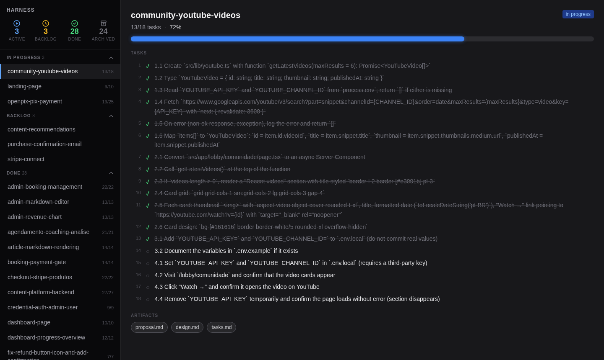

# harness-admin

[](https://www.npmjs.com/package/harness-admin)
[](LICENSE)
[](https://nodejs.org)

A local dashboard for Specification-Driven Development projects.

```bash
npx harness-admin
```

---

## Why

You have 20 specs in flight. Some are done, some are stuck in backlog, a few are actively being worked on — but to know which is which you have to open each directory and read through the files.

Harness reads your `changes/` directory and gives you a real-time visual of every spec: grouped by status, task-level progress, archive actions — updated live as you work.



---

## Quick Start

```bash
cd your-project
npx harness-admin
```

Opens at `http://localhost:3000`. Browser launches automatically.

```bash
npx harness-admin --tui    # terminal UI
npx harness-admin -p 3001  # custom port
```

**Requires Node.js 18+**

---

## Usage

```bash
harness                                    # browser dashboard
harness --tui                              # terminal UI
harness -p 3001                            # custom port
harness --config ./harness.config.json     # custom config
```

---

## How it works

Harness scans `openspec/changes/` for subdirectories. Each one is a **change** — a unit of work tracked by a `tasks.md` checklist. Status is derived automatically:

| Status | Condition |
|---|---|
| `in progress` | at least one `[x]` and at least one `[ ]` |
| `done` | all tasks `[x]` |
| `backlog` | no `tasks.md` or zero checked tasks |
| `archived` | path is inside the archive directory |

The filesystem is the source of truth. Changes are watched via `chokidar` and pushed to the browser over WebSocket — no refresh needed.

---

## Directory convention

```
your-project/
└── openspec/
    └── changes/
        ├── my-feature/
        │   ├── proposal.md
        │   ├── design.md
        │   └── tasks.md
        └── archive/
            └── shipped-feature/
                └── tasks.md
```

Works with any project that follows this shape — no framework required. Compatible with [OpenSpec](https://github.com/davi-canuto/openspec) and any hand-rolled SDD workflow.

**Nested changes** are supported — a parent directory without its own `tasks.md` but with sub-directories that have one becomes a group with aggregated progress.

---

## Configuration

Zero config for OpenSpec projects. To customize, create `harness.config.json` at your project root:

```json
{
  "changesDir": "openspec/changes",
  "archiveDir": "openspec/changes/archive",
  "tasksFile": "tasks.md",
  "proposalFile": "proposal.md",
  "designFile": "design.md",
  "port": 3000
}
```

### Multi-repo

Point Harness at multiple projects simultaneously:

```json
{
  "projects": [
    { "name": "frontend", "path": "/path/to/frontend" },
    { "name": "api",      "path": "/path/to/api" }
  ]
}
```

A project switcher appears in the sidebar. "All projects" shows a merged view with project badges on each change.

---

## Features

- **Grouped sidebar** — changes organized by status with collapsible sections
- **Live updates** — WebSocket pushes filesystem changes to the browser instantly
- **Archive from the board** — move a change to archive without touching the terminal
- **Terminal UI** — full `--tui` mode with keyboard navigation (`↑↓/jk`, `a`, `q`)
- **Resizable sidebar** — drag the edge to fit your screen
- **Nested changes** — parent changes aggregate progress across sub-changes
- **Multi-repo** — monitor multiple projects from a single dashboard

---

## Roadmap

- [ ] **Claude integration** — chat with `proposal.md` + `design.md` + `tasks.md` pre-loaded
- [ ] **Apply by task** — delegate a specific task to Claude Code from the UI
- [ ] **New change** — create a spec with AI-generated proposal, design and tasks from a description
- [ ] **Multi-repo improvements** — per-project config, consolidated metrics

---

## Package structure

```
packages/
├── parser/   Filesystem reader, task parser, status classifier, chokidar watcher
├── server/   Fastify server — REST API, WebSocket, static file serving
├── board/    Browser SPA — Vite + React + Tailwind CSS
├── tui/      Terminal UI — Ink + React
└── cli/      npm entry point — wires everything together
```

---

## Contributing

```bash
git clone https://github.com/davi-canuto/harness-admin
cd harness-admin
pnpm install
pnpm build
```

Development against a local project:

```bash
# Terminal 1 — API server
cd /path/to/your-project
node /path/to/harness-admin/packages/cli/dist/index.js

# Terminal 2 — board with hot reload
cd /path/to/harness-admin/packages/board
pnpm dev
```

Every change to Harness goes through an OpenSpec change in `openspec/changes/`. See `AGENTS.md` for the workflow.

---

## License

MIT
